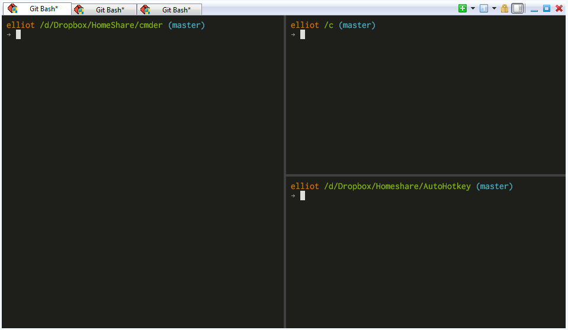

# Cmder Configuration

This is my configuration for running a portable [Cmder](https://github.com/bliker/cmder)

Included:
- ConEmu config
    + Bash as default shell
    + Git icon for Bash
    + Bash Explorer context
    + `Alt` + `Shift` + `1` or `2` for vertical or horizonal splitting
- Personal `.bash_aliases`
    - Modified `profile` for Msysgit to allow loading of portable aliases